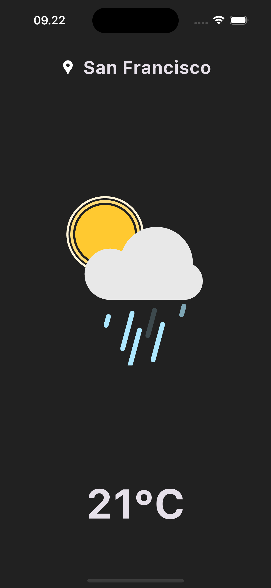
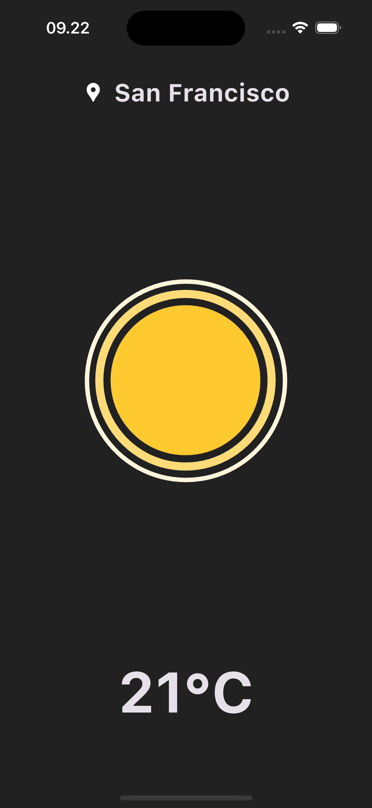

# 🌤️ Minimalist Weather App

A simple and clean weather application built with **Flutter** that shows real-time weather conditions using the [OpenWeather API 2.5](https://openweathermap.org/api).

## ✨ Features
- 🌍 Get current weather by **city name**  
- 📍 Get weather by **current location (GPS)**  
- 🌡️ Show temperature, weather condition, and city name  
- 🖼️ Minimalist UI with clean design  
- 🔑 Secure API key management with `flutter_dotenv`

## 🚀 Tech Stack
- **Flutter** (cross-platform mobile framework)  
- **Dart**  
- **OpenWeather API 3.0**  
- **Geolocator & Geocoding** (get current location and city)  
- **http** (fetch data from API)
- **flutter_dotenv** (manage API keys securely)

## 📸 Screenshots

|     Weather Detail    |
|-----------------------|
|   |

## ⚙️ Installation
1. Clone this repository:
   ```bash
   git clone https://github.com/wandi1209/minimalist-weather-app.git
   cd minimalist-weather-app
   ```
2. Install dependencies:
   ```bash
   flutter pub get
   ```
3. Create a `.env` file in the root directory and add your OpenWeather API key:
   ```env
   OPENWEATHER_API_KEY=your_api_key_here
   ```
4. Run the app:
   ```bash
   flutter run
   ```

## 📂 Project Structure
```
lib/
│── models/
│   └── weather_model.dart     # Weather data model
│── services/
│   └── weather_service.dart   # API service to fetch weather
│── main.dart                  # App entry point
```

## 🛠️ How It Works
1. App detects **current location**  
2. App requests weather data from **OpenWeather API 2.5**  
3. Data is parsed into `Weather` model  
4. UI displays temperature, weather condition, and city name in a minimalist layout  
